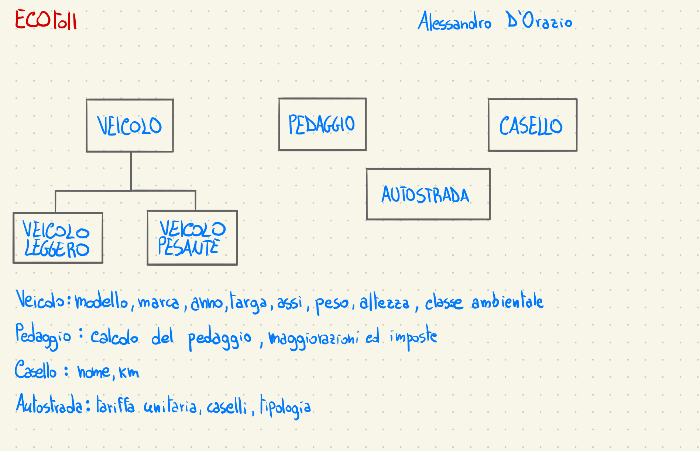

# ECOtoll
Il progetto "ECOtoll" è un homework assegnato come prova parziale per l'esame di Object Oriented Software Design. Il codice è stato interamente progettato, scritto e revisionato da Alessandro D'Orazio.

## Autostrada
L'entità autostrada si occupa di gestire la denominazione, i caselli (mediante LinkedList) e la tipologia della rete autostradale (pianura o montagna). Inoltre possiede anche le informazioni riguardanti le tariffe unitarie per ciascuna classe dei veicoli.

Per veicolo leggero si intende un veicolo con due assi (o meno) e un'altezza massim di 130cm

## Veicolo
Il veicolo è l'entità con sottoclassi VeicoloLeggero e VeicoloPesante, per registrare modello, marca, targa, classe ambientale, anno, assi, peso e altezza. Inoltre tramite il metodo nuovoVeicolo è possibile istanziare un veicolo, sia di tipo leggero che pesante. Inoltre è presente l'interfaccia InterfacciaVeicolo, implementata da VeicoloLeggero e VeicoloPesante per realizzare i metodi della classe tariffaria.

## Pedaggio
Il pedaggio contiene un Helper per l'arrotondamento del pedaggio finale ai 10 centesimi di euro (realizzato tramite BigDecimal), e il calcolo del pedaggio, che si ottiene moltiplicando i km percorsi con la tariffa unitaria del veicolo, moltiplicati a sua volta per l'IVA (22%)

## Casello
L'entità casello dispone di nome e km in cui si trova. Viene utilizzata dall'autostrada per registrare i caselli di quest'ultima e dall'entità pedaggio per il calcolo del pedaggio autostradale.

## Normative future
I pedaggi differenziati (normativa del 2021) possono essere introdotti nella classe VeicoloPesante , e potranno essere estese alle automobili (dal 2026).

Per attenersi alla normativa sarà sufficiente creare un vettore contenente i pedaggi per ogni classe ambientale, e modificare l'algoritmo del calcolo del pedaggio, sostituendo la tariffa unitaria con il pedaggio differenziato. 

#### Crediti
Progetto sviluppato da [Alessandro D'Orazio](https://alessandrodorazio.it) in Java
